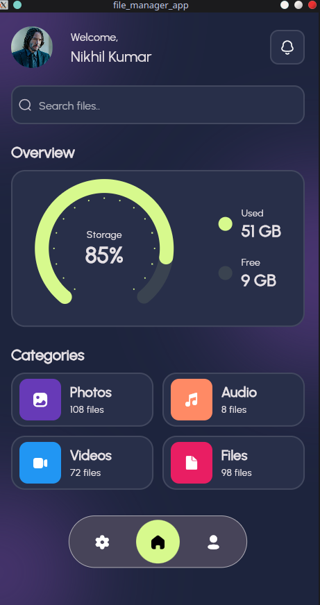
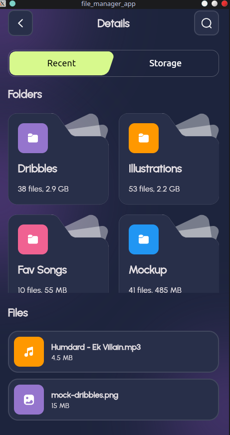
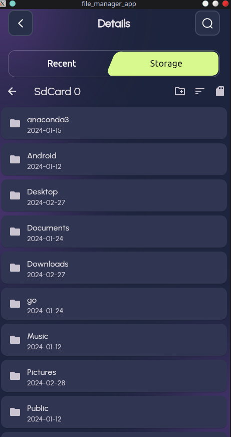

# 📁 File Manager App

Welcome to **File Manager App**, your ultimate companion for streamlined file management on Flutter!

## What Makes File Manager App Special?

File Manager App is not just another file management tool; it's a revolution in mobile file organization. Crafted with Flutter, it empowers users to effortlessly organize, browse, and manage files on their devices. With its sleek interface and powerful features, File Manager App redefines the way you interact with your files, offering unparalleled ease and efficiency.

## Features That Set Us Apart

- **Intuitive Interface**: Seamlessly navigate files with our intuitively designed interface.
- **Effortless File Operations**: Copy, move, rename, and delete files with a single tap.
- **Seamless File Browsing**: Dive into directories and browse files like never before.
- **Tailored Customization**: Personalize settings and preferences to match your unique style.
- **Flawless Responsiveness**: Experience flawless performance across all screen sizes and orientations.

## Sneak Peek - Screenshots 📸

  
  
  

## Getting Started 🚀

1. **Clone this Repository**: Get the latest version by cloning this repository to your local machine.
2. **Set Up Flutter**: Make sure you have Flutter installed and properly configured.
3. **Install Dependencies**: Run `flutter pub get` to install all necessary dependencies.
4. **Launch the App**: Connect your device/emulator and run `flutter run` to launch the application.

## Dependencies 📦

- [flutter_screenutil](https://pub.dev/packages/flutter_screenutil): Craft responsive UIs with ease.
- [google_fonts](https://pub.dev/packages/google_fonts): Integrate stunning Google Fonts effortlessly.
- [fluentui_system_icons](https://pub.dev/packages/fluentui_system_icons): Access a vast collection of Fluent UI icons for your app.
- [iconly](https://pub.dev/packages/iconly): Explore a comprehensive set of icons tailored for your application.
- [percent_indicator](https://pub.dev/packages/percent_indicator): Implement captivating progress indicators effortlessly.
- [file_manager](https://pub.dev/packages/file_manager): Unleash the power of file management within your app.

## Contributing 🤝

We wholeheartedly welcome contributions to File Manager App! Feel free to fork the repository, make your enhancements, and submit pull requests to make File Manager App even better.

## License 📄

File Manager App is licensed under the [MIT License](LICENSE). Feel free to modify and distribute it according to your needs.

Thank you for choosing File Manager App! Let's embark on a journey of delightful file organizing together! 🌟
